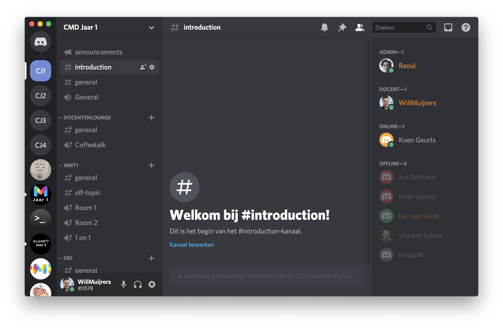

# Hoe gebruik ik Discord?


Work in Progress


## Waarom Discord?

Discord is geweldig communicatieplatform waar docenten en studenten kunnen samenwerken, delen of gewoon kunnen kletsen. Discord geeft ons mogelijkheden sneller en efficienter te werken ten opzichte van klassiek e-mail. 

Het is dé manier om feedback te krijgen van je docent, documenten te delen, [_syntax-highlighted_](https://en.wikipedia.org/wiki/Syntax_highlighting) code doorsturen, mededelingen te communiceren, deelnemen aan polls, afspraken te maken en nog veel meer. 


Vrijwel alle communicatie rondom je vakken verloopt via Discord. **Werken en communiceren met Discord is daarom verplicht.**


### Discord downloaden

Discord werkt als desktop app, webapp en mobile app. [Download Discord](https://discord.com/download) en ga aan de slag!



## Aanmelden bij een Discord server

Discord werkt met zogenaamde _Discord servers._ Dit is een soort hub vanwaaruit alle communicatie plaatsvindt. Ieder leerjaar heeft een specifieke server. 

In de servers kun je jezelf inschrijven voor vakken die zijn onderverdeeld in diverse _channels_. Gebruik onderstaande invite link om je in te schrijven.

#### CMD

| server naam | invite link |
| :--- | :--- |
| CMD jaar 1 | [https://discord.gg/eDjXFzz](https://discord.gg/eDjXFzz) |
| CMD jaar 2 | [https://discord.gg/GryKTet](https://discord.gg/GryKTet) |
| CMD jaar 3 | [https://discord.gg/D24yyQm](https://discord.gg/D24yyQm) |
| CMD jaar 4 | [https://discord.gg/m33HnBB](https://discord.gg/m33HnBB) |

#### VisCom

| server naam | invite link |
| :--- | :--- |
| Viscom jaar 1 |  |
| Viscom jaar 2 |  |
| Viscom jaar 3 |  |
| Viscom jaar 4 |  |

