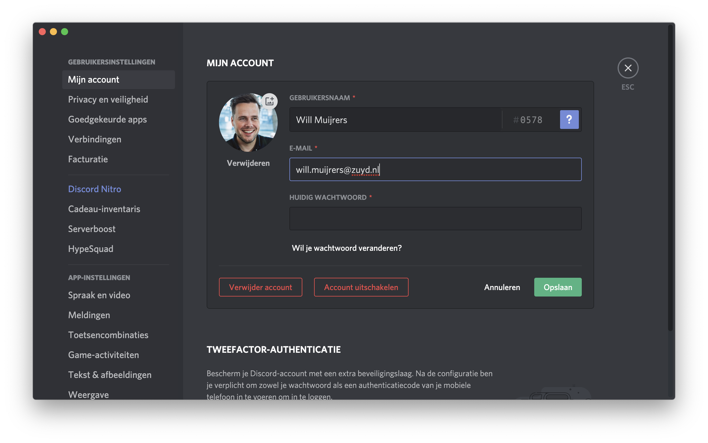
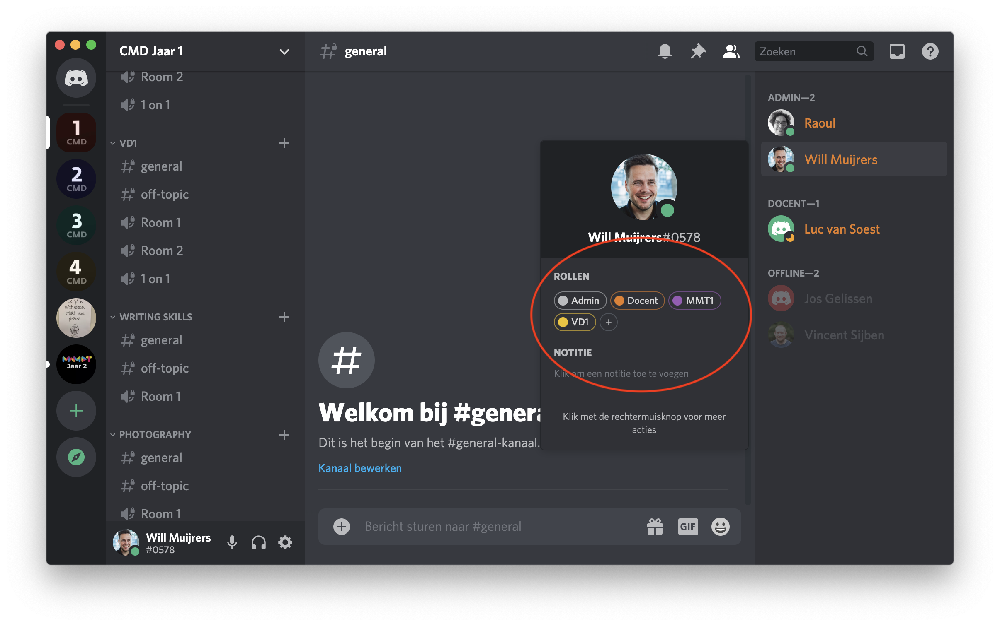
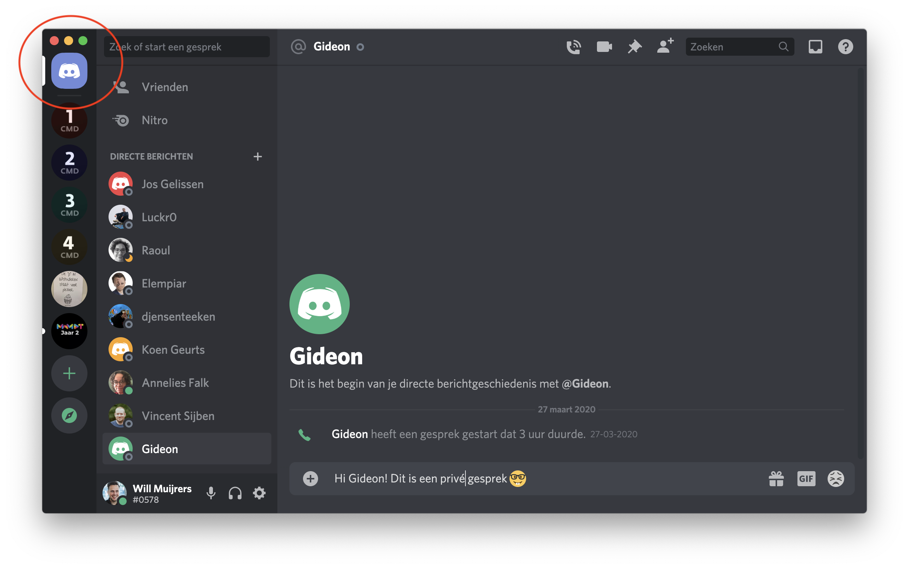
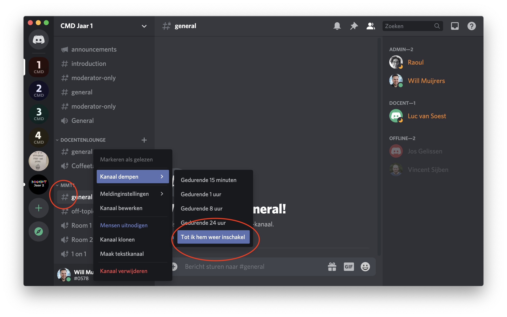

# Hoe gebruik ik Discord?

## 🤷 Waarom Discord?

Discord is geweldig communicatieplatform waar docenten en studenten kunnen samenwerken, delen of gewoon kunnen kletsen. Discord geeft ons mogelijkheden sneller en efficienter te werken ten opzichte van klassiek e-mail. 

Het is dé manier om feedback te krijgen van je docent, documenten te delen, [_syntax-highlighted_](https://en.wikipedia.org/wiki/Syntax_highlighting) code doorsturen, screen sharing, deelnemen aan polls en nog veel meer. 


Vrijwel alle communicatie rondom je vakken verloopt via Discord. **Werken en communiceren met Discord is daarom verplicht.**


### Discord downloaden

Discord werkt als desktop app, web app en mobile app. [Download Discord](https://discord.com/download) en ga aan de slag!



## 🤘 Aanmelden Discord server

Discord werkt met zogenaamde _**Discord servers**._ Dit is een soort hub vanwaaruit alle communicatie plaatsvindt. Ieder leerjaar heeft een specifieke server. 

In de servers kun je jezelf inschrijven voor vakken die zijn onderverdeeld in diverse _**\#kanalen**_. Gebruik onderstaande invite link om je in te schrijven.

#### CMD

| server naam | invite link |
| :--- | :--- |
| CMD jaar 1 | [https://discord.gg/eDjXFzz](https://discord.gg/eDjXFzz) |
| CMD jaar 2 | [https://discord.gg/GryKTet](https://discord.gg/GryKTet) |
| CMD jaar 3 | [https://discord.gg/D24yyQm](https://discord.gg/D24yyQm) |
| CMD jaar 4 | [https://discord.gg/m33HnBB](https://discord.gg/m33HnBB) |

#### VisCom

| server naam | invite link |
| :--- | :--- |
| Viscom jaar 1 | [https://discord.gg/7z8hwGX](https://discord.gg/7z8hwGX) |
| Viscom jaar 2 | [https://discord.gg/dMReZEC](https://discord.gg/dMReZEC) |
| Viscom jaar 3 | [https://discord.gg/AaEHhfU](https://discord.gg/AaEHhfU) |
| Viscom jaar 4 | [https://discord.gg/DGVMaUU](https://discord.gg/DGVMaUU) |

## 🙋♂ Voor we verder gaan, enkele basisregels

Onze discord servers vormen een formele online werkplek en is daarmee louter bedoeld voor communicatie rondom schoolactiviteiten. Houd rekening met de privacy van jezelf en anderen. 


Het is belangrijk dat docenten en medestudenten weten met wie ze praten in de server. **Het is verplicht om je voor- en achternaam als Discord-naam te gebruiken. Het is verplicht om een duidelijke foto van jezelf als avatar in te stellen.**


## 🚗 Jezelf toevoegen aan een vak / \#kanaal

De server \(leerjaar\) is onderveeld in diverse _**\#kanalen**_ \(vakken binnen het leerjaar\). Een kanaal staat meestal voor één specifiek vak maar het kan ook een minor, groepschat of ander doeleinde hebben. Je kunt jezelf toevoegen aan alle \#kanalen / vakken door middel van _**rollen**_.

Ieder vak correspondeert met een specifieke rol. Om toegang te krijgen tot _\#MMT1_  dien je de rol MMT1 te hebben, om toegang te krijgen tot \#VD1 dien je de rol _VD1_ te hebben en ga zo maar door.


In de toekomst zal het mogelijk zijn om jezelf een specifieke rol te geven. Zo kun je zelf beheren welke \#kanalen / vakken je wel of niet volgt. Voorlopig is die feature er nog niet en zul je door de admin docenten automatisch rollen krijgen toegekend. Mis je rollen of heb je vragen? Stuur een prive bericht naar een docent in Discord.


### Een vak / \#kanaal verlaten

Wil je een \#kanaal verlaten omdat het groepsproject is afgelopen of omdat de periode voorbij is en je het vak niet meer volgt? Verwijder in dat geval simpelweg de corresponderende rollen bij je serverprofiel. Het is ook mogelijk om kanalen op mute te zetten oftewel te dempen. In dat geval krijg je geen kanaalmeldingen meer.


Moet je onverhoopt een vak herkansen? Verlaat in dat geval het kanaal, van het vak waarvoor je de herkansing hebt, nog niet! Communicatie rondom herkansingen zal plaatsvinden in het orginele kanaal. 


## 🔒 Een privégesprek \(DM\) starten

Wanneer je een _Direct Message_ oftwel een privégesprek wilt voeren kun je dat doen met alle leden waarmee je een server deelt. In een privégesprek kun je ook bellen of je scherm delen. Je hoeft dus niet perse iemand toe te voegen als vriend om een DM te starten. Privégesprekken worden verzameld op je Discord startpagina. 

## 🔇Kanalen dempen \(mute\)

Je bent nu ingeschreven voor verschillende vakken in de corresponderende \#kanalen. Dit kunnen er al snel een boel zijn. Het is aan te raden om kanalen waarvoor je geen meldingen wilt ontvangen te muten. Rechtermuisknop op een of meerdere kanalen om je persoonlijke instellingen voor het kanaal te wijzigen.

