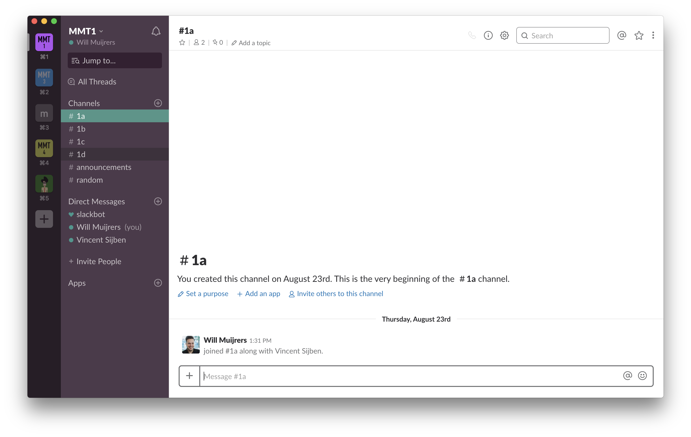
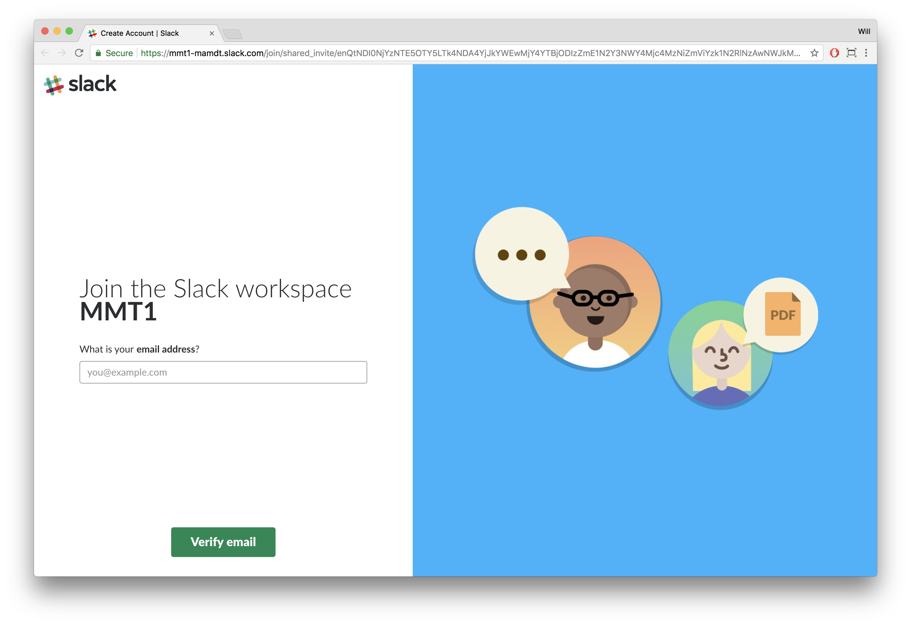
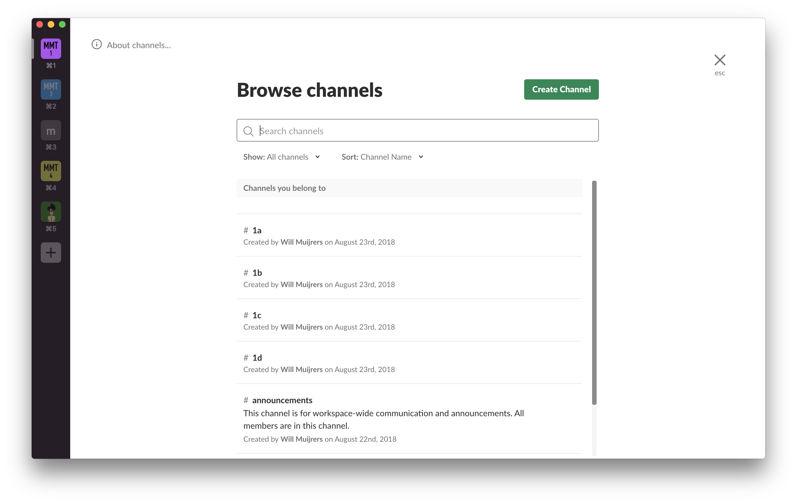
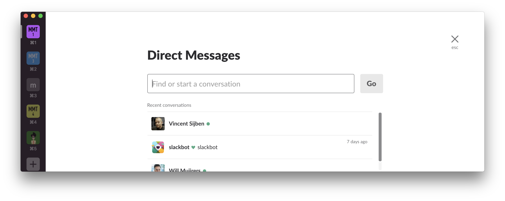
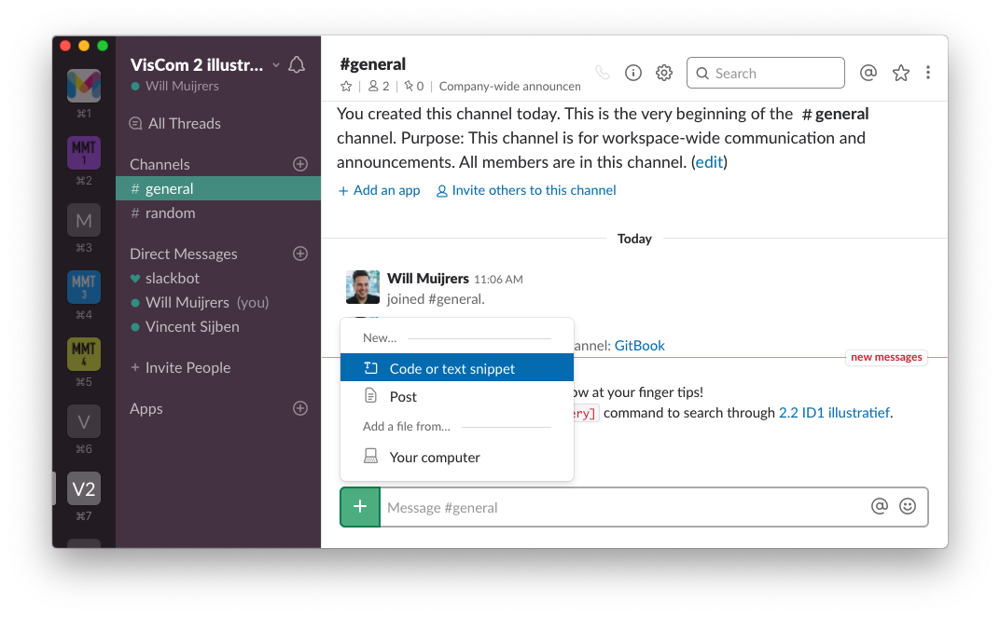

# Hoe gebruik ik Slack?


**Vanaf schooljaar 2020-2021 zullen we Slack verlaten. Alle communicatie zal via**  [**Discord**](https://discord.com/download) **servers lopen.**


## Waarom Slack

Na jouw loopbaan bij MAMDT achten we de kans klein dat je met Blackboard of Moodle zult gaan werken. We zijn er wél vrij zeker van dat je een _collaboration tool_ zult gaan gebruiken. Waarom dan nú niet al een tool gebruiken die krachtig én populair is?

> Slack brings your team and their conversations together in one place. Discussions are organized into channels, so there’s a place for every project, team or department.  
> ...  
> All messages in public channels, files, uploads and incoming information become indexed and searchable once inside Slack, giving your team access to the collective knowledge of the company.  
>   
> [https://slack.com/](https://slack.com/)

* e-mail is zó 1990;
* coaching via e-mail is omslachtig voor \(vraag-antwoord en doorvragen\). E-mail is geen chat-oplossing;
* je kunt chatten met je peers zonder privé-zaken als WhatsApp of Facebook te hoeven delen;
* je docent kan ook buiten lestijden sneller reageren;
* je kunt berichten direct delen met je hele klas, of een specifiek aantal peers;
* je kunt [_syntax-highlighted_](https://en.wikipedia.org/wiki/Syntax_highlighting) code doorsturen;
* je kunt zoeken naar eerdere reacties of gedeelde documenten;
* we kunnen polls delen en realtime resultaten zien;
* het platform bevat uitstekende notificatie instellingen.

### Aanmelden bij een Workspace

Slack maakt gebruik van zogenaamde _workspaces_. Dit is een soort hub vanwaaruit alle communicatie plaatsvind. Ieder vak heeft een specifieke workspace. Je dient je dus allereerst aan te melden voor de workspace.


**In de Gitbook van het vak tref je de aanmeldlink voor de corresponderende Slack Workspace.** Ieder vak heeft z'n eigen Gitbook WorkSpace.



**De workspace is alleen bereikbaar door gebruikers met een @zuyd.nl e-mailadres.** Gebruik dus alleen je zuyd e-mail bij het inloggen in de workspace. 


### Toevoegen aan een of meerdere channels

Nu je bent toegevoegd aan de workspace kun je aan slag met communiceren in Slack. Je kunt zelf bepalen met wie, of met welke groep je wilt communiceren. Slack werkt met _channels._ Dit zijn  groepen waarin meerdere gebruikers samen communiceren over een onderwerp. We hebben al een aantal channels aangemaakt waarin je jezelf kunt toevoegen. Je kunt ook zelf een channel maken en deze met anderen delen.


Een channel is niet privé. Anderen kunnen de communicatie in een channel bekijken en zichzelf toevoegen.


#### Bestaande channels vinden

Om bestaande channels te vinden klik je op _channels_ in de linker zijbalk \(notification panel\). Via _browse all channels_ kun je de bestaande channels bekijken en jezelf toevoegen. 

#### **Zelf een channel maken**

Maak zelf channels en deel deze met klasgenoten om over specifieke onderwerpen te communiceren. Klik op  **+** naast _channels_ in de linker zijbalk \(notification panel\) om een nieuw channel te maken.

### Privé berichten \(Direct Message\)

Een privé bericht is alleen zichtbaar voor jou en de persoon waarna je het bericht stuurt. Klik op  **+** naast _Direct Messages_ in de linker zijbalk \(notification panel\) om een nieuw privé bericht te starten.

### Code delen

Met Slack kun je eenvoudig code delen met je peers of vakdocent. Klik op de _**+**_ naast het berichtveld en kies _**code or text snippet**_. De code die je vervolgens plakt zal een mooie [_syntax highlighting_](https://en.wikipedia.org/wiki/Syntax_highlighting) krijgen.

### Verder nog iets?

Slack, en dus je workspaces, zijn bereikbaar via allerlei media. Je kunt Slack bereiken via een browser. Maar Slack heeft ook een [desktop apps en mobile apps](https://slack.com/downloads/). 

Zoek je nog meer info over het gebruik Slack? Alle info rondom Slack is te vinden het [Slack's Help Center](https://get.slack.help/hc/en-us/articles/115004071768-What-is-Slack-)


Slack en Gitbook werken samen. Wil je in Slack wat zoeken of verwijzen naar een onderdeel in deze Gitbook? Typ dan `/gitbook [search query]` en doorzoek het document.


